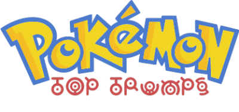
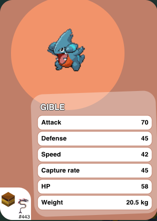
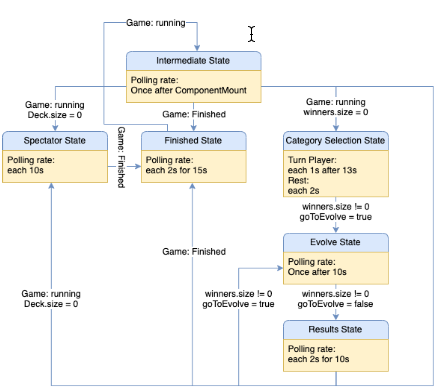

# SoPra FS20 - Group 20

# IFImon - Top Trumps

Server-repository: https://github.com/Team-Heroket/IFImon-server

Play here: https://sopra-fs20-group-20-client.herokuapp.com/


## Introduction:

This Pokèmon inspired game is based on the popular card game [Top Trumps](https://en.wikipedia.org/wiki/Top_Trumps). 

Every player in a game is dealt a fixed amount of cards (between 2 and 6), the game creator is the first assigned turnplayer. 

Every card represents a Pokémon with unique values to the stats: Attack, Defense, Speed, Capture rate, HP and Weight.
When the game starts, every player is dealt between 2 to 6 random cards and an amount of berries equal to the number of players participating in the game.

The creator of the lobby starts as the first turn player.
The turn player has then 14 seconds to choose a category which he thinks has the highest value.

After these 14s have passed, everyone will have the possibility to see the card which has the highest value in the choosen category and choose to either evolve their Pokemon or not. 

If there are evolutions available for a Pokemon, buttons will appear which displays the Evolution name and it's cost.
At the start of each game each player receives as many berries as the number of players in the game. Once those are used up there are no new ones handed out!
You have 10 seconds to decide, if you misclick you can click again on the button to deselect it!

After these 10s the results of the current round are displayed for 10s before a new turn starts.

The game ends when all players except one have 0 cards in their deck. 



## Technologies:
 
 We used following `npm` packages:
 - [Styled-components](https://styled-components.com/): Utilising tagged template literals (a recent addition to JavaScript) and the power of CSS, styled-components allows you to write actual CSS code to style your components. It also removes the mapping between components and styles – using components as a low-level styling construct could not be easier!
 - [react-router-dom](https://reacttraining.com/react-router/web/guides/quick-start): Declarative routing for React being a collection of navigational components that compose declaratively with your application.                                                      
 - [@material-ui](https://material-ui.com/): Open-source project that features React components that implement Google's Material Design.                                                  
 - [react-confetti](https://www.npmjs.com/package/react-confetti): For an confetti animation. Confetti without the cleanup.                                                   
 - [typewriter-effect](https://www.npmjs.com/package/typewriter-effect): A simple yet powerful native JS plugin for a cool typewriter effect.
 - [typewriter-effect](https://www.npmjs.com/package/typewriter-effect): A simple yet powerful native JS plugin for a cool typewriter effect.
 - [react-popupbox](https://www.npmjs.com/package/react-popupbox): A simple lightbox component for react, inspired by colorbox and React-Lightbox.
 - [react-countdown-circle-timer](https://www.npmjs.com/package/react-countdown-circle-timer): React countdown timer component in a circle shape with color and progress animation.
 - [react-card-flip](https://www.npmjs.com/package/react-card-flip): React Card Flip is allows you to use the card flipping animation.
                                    
## High-level components:
#### Game Component
Our game is structured in an hierachical manner, we have a master screen which handles all the in-game server requests.
And it switches between the various subscreens based on the server responses and it also handels all the in-game timers.
All the subscreen are visible in the state diagram below, and effectively represents what a user will see dring the course of a game. 



#### Pokemon Card Component:
This component handles the representation of all the pokemon's information we recieve from the API. 
for example this is the response for Pikachu (number 25):
    
    {
        "pokemonId": 25,
        "categories": {
            "DEF": 40,
            "HP": 35,
            "SPEED": 90,
            "CAPTURE_RATING": 190,
            "ATK": 55,
            "WEIGHT": 60
        },
        "name": "Pikachu",
        "spriteURL": "https://raw.githubusercontent.com/PokeAPI/sprites/master/sprites/pokemon/25.png",
        "cryURL": "https://play.pokemonshowdown.com/audio/cries/pikachu.mp3",
        "elements": [
            "ELECTRIC"
        ],
        "evolutionNames": [
            "Raichu"
        ]
    }
    
and we display it as follows: 


#### Create Game component:
This Component handles the initialization of a new game. The user is able to choose the amount of NPC players he wants in the game, the number of cards and the range of Pokemon generation he wants to see.
He can also kick people from the lobby that joined 'his' game. Once the creator clicks start,he is sent to the normal lobby and as soon as the server generated all cards the game will start. 
During the lobby and/or create game it is possible to click on a user to see the corresponding user statistc card.

#### Pokedex Component:
In the main menu page all the player's encountered pokemons are displayed and when one of these pokemons is clicked it's corresponding card is generated and displayed. 

#### Leaderboard Component:
All the server's users are displayed in descending order by rank and are clickable. When a user is clicked it's corresponding user statistics card is displayed on the right below the logged user one.
This makes it easier to compare the statistics between the user and the rest. 
 - Rank: a user start witha  rank = 0 the more games you win the higher the rank becomes: `rank = 2*amount of wins - amount of losses`

## Launch & Deployment:

### Client deployment:
For your local development environment you'll need Node.js >= 13.0. You can download it [here](https://nodejs.org). All other dependencies including React get installed with:

### `npm install`

This has to be done before starting the application for the first time (only once).

### `npm run dev`

Runs the app in the development mode.<br>
Open [http://localhost:3000](http://localhost:3000) to view it in the browser.

The page will reload if you make edits.<br>
You will also see any lint errors in the console (use Google Chrome!).

### `npm run test`

Launches the test runner in the interactive watch mode.<br>
See the section about [running tests](https://facebook.github.io/create-react-app/docs/running-tests) for more information.

### `npm run build`

Builds the app for production to the `build` folder.<br>
It correctly bundles React in production mode and optimizes the build for the best performance.

The build is minified and the filenames include the hashes.<br>
Your app is ready to be deployed!

See the section about [deployment](https://facebook.github.io/create-react-app/docs/deployment) for more information.

### Server deployment:

#### IFImon-Server:
The [IFImon-Server](https://github.com/Team-Heroket/IFImon-server) must be running in order for the application to run correctly.


#### Building with Gradle:


You can use the local Gradle Wrapper to build the application.

Plattform-Prefix:

-   MAC OS X: `./gradlew`
-   Linux: `./gradlew`
-   Windows: `./gradlew.bat`

More Information about [Gradle Wrapper](https://docs.gradle.org/current/userguide/gradle_wrapper.html) and [Gradle](https://gradle.org/docs/).

##### Build

```bash
./gradlew build
```

##### Run

```bash
./gradlew bootRun
```

##### Test

```bash
./gradlew test
```

## Illustrations:
### First time Login/register user actions:


### Create new game and start and one turn:


## Roadmap:
- Ability to join random existing lobby
- Add a carreer mode with premade decks with increasing difficulty
- Selectable difficulty level of BOTS
- More detailed Ranking system, with formatting/icons based on the players ranks
- Ability to change background music
- Add SFXs throughout the game (for example when a pokemon evolves, card is handed out)


## Authors and acknoledgements:
#### Authors:
[@alexandertheus](https://github.com/alexandertheus) 
[@timothyZimmermann](https://github.com/timothyZimmermann)

#### Acknoledgements:
[@royru](https://github.com/royru) for the Software Praktikum template
>Thanks to Lucas Pelloni for the template


## License:
Apache License 2.0


Pokémon and Pokémon character names are trademarks of Nintendo.


